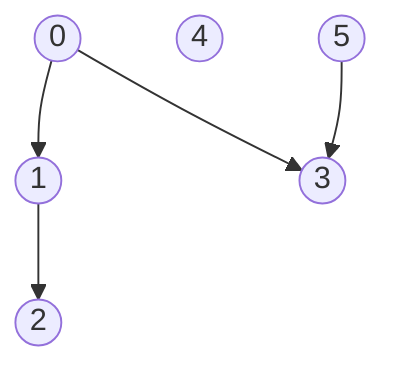
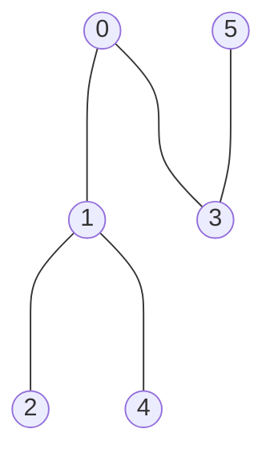
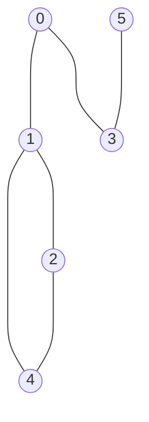
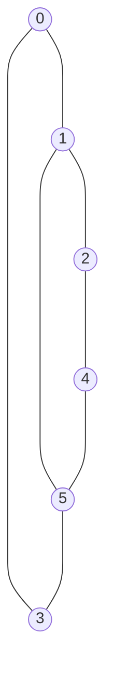
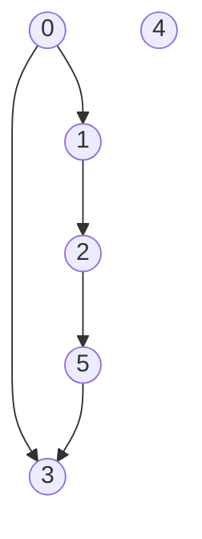
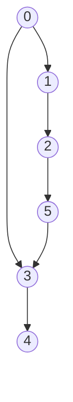

# Depth-first search
Set of programming assignments that are designed to test knowledge of DFS traversal for graphs.

## Problem 1: Check if a (v, u)-path exist in a directed graph

Given the number of vertices `n`, graph edges (adjacency dictionary) `edges` and vertices `v` and `u` for a directed graph, write a function to check whether (v, u)-path exists or not. Vertices are enumerated from `0` to `n-1`.

**Example 1:**

`v` = 0, `u` = 2

Expected result: True

**Example 2:**

`v` = 3, `u` = 1

Expected result: False

Please use a template for the implementation (`tasks/path_existence:check_path_existence`).

## Problem 2: Check if an undirected connected graph is bipartite

Given the number of vertices `n` and graph edges (adjacency dictionary) `edges` for an undirected connected graph, return True if graph is bipartite, otherwise False. Vertices are enumerated from `0` to `n-1`.

**Example 1:**

Expected result: True.

**Example 2:**

Expected result: False.

**Example 3:**

Expected result: True.

Please use a template for the implementation (`tasks/bipartite_graph:check_bipartite_graph`).

## Problem 3: Find the length of the longest eligible path in a directed acyclic graph

Given the number of vertices `n`, graph edges (adjacency dictionary) `edges` for a directed acyclic graph, return the length of the longest eligible path. Vertices are enumerated from `0` to `n-1`.

**Example 1:**

Expected result: 2

**Example 2:**

Expected result: 4

**Example 3:**

Expected result: 5

Please use a template for the implementation (`tasks/longest_path:find_the_longest_path_in_dag`).
