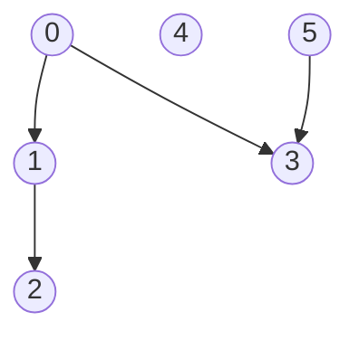
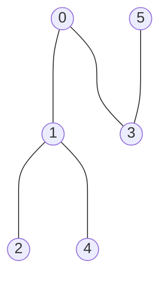
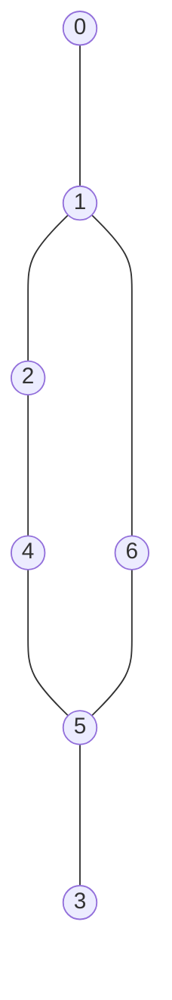
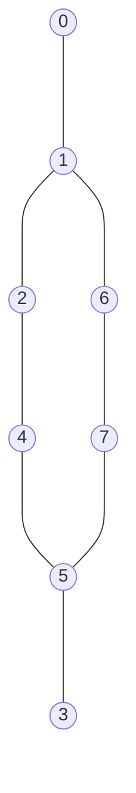
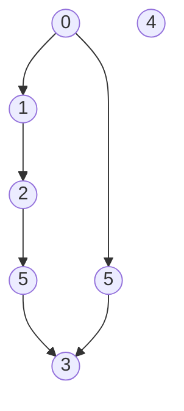
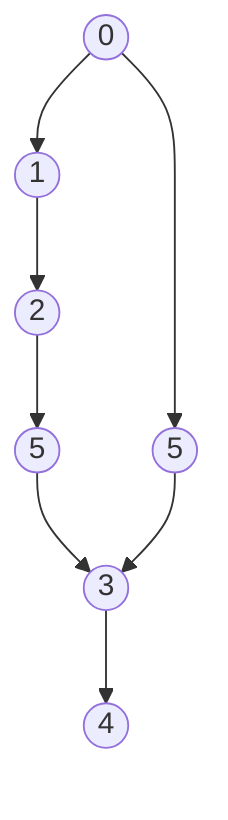

# Depth-first search

## Purpose

The coding exercises are designed to test your knowledge of the following concepts:

* DFS traversal
* Applying DFS traversal in practice

## Overview

The coding exercises cover the following practical problems:
* Checking to see if a (v, u)-path exists in a directed graph
* Checking to see if an undirected connected graph is bipartite
* Finding the length of the longest eligible path in a directed acyclic graph

## Coding exercises

### Exercise 1: Check to see if a (v, u)-path exists in a directed graph

Given the number of vertices `n`, graph edges (adjacency dictionary) `edges`, and vertices `v` and `u` for a directed graph, implement the function below to check whether a (v, u)-path exists or not. Vertices are enumerated from `0` to `n-1`.

```python
def check_path_existence(n: int, edges: Dict[int, Set], v: int, u: int) -> bool:
    """
    Returns True/False depending on the existence of an eligible path from vertex v to vertex u in a directed graph.
    Vertices are enumerated from 0 to N-1, where N is the number of vertices.

    For example, you have a graph with five vertices from 0 to 4 and the edges {1: {0, 3}, 0: {2}, 3: {4}}.
    There is a path from vertex 1 to vertex 4: 1 -> 3 -> 4, so for v=1 and u=4, the function should return True.
    At the same time, no path exists from vertex 2 to vertex 0, so the expected result is False.

    Parameters:
        n (int) : the number of vertices in the graph; vertices are enumerated from 0 to n-1
        edges (Dict[int, Set]): adjacency dictionary which stores a set of adjacent vertices for each vertex
        v (int): start path vertex
        u (int): end path vertex
    Returns:
        bool: True or False, depending on whether a (v,u)-path exists
    """
    pass
```

**Example 1:**

`v` = 0, `u` = 2

Expected result: True


**Example 2:**

`v` = 3, `u` = 1

Expected result: False

<br/>

Please use the template `tasks/path_existence:check_path_existence` for the implementation.

### Exercise 2: Check to see if an undirected connected graph is bipartite

Given the number of vertices `n` and graph edges (adjacency dictionary) `edges` for an undirected connected graph, implement the function below so that it returns True if graph is bipartite and False if not. Vertices are enumerated from `0` to `n-1`. 

```python
def check_bipartite_graph(n: int, edges: Dict[int, Set]) -> bool:
    """
    Returns True/False if a connected undirected graph is bipartite or not.
    Vertices are enumerated from 0 to N-1, where N is the number of vertices.

    For example, you have a graph with five vertices from 0 to 4 and the edges {0: {1}, 1: {0, 2}, 2: {1, 3}, 3: {2, 4}, 4: {3}.
    This graph is bipartite because you can select two sets of vertices, {0, 2, 4} and {1, 3}, that don't have inner edges.

    Parameters:
        n (int) : the number of vertices in the graph, vertices are enumerated from 0 to n-1
        edges (Dict[int, Set]): adjacency dictionary which stores a set of adjacent vertices for each vertex
    Returns:
        bool: True or False if a graph is bipartite or not
    """
    pass
```

**Example 1:**


Expected result: True.

**Example 2:**


Expected result: False.

**Example 3:**


Expected result: True.

<br/>

Please use the template `tasks/bipartite_graph:check_bipartite_graph` for the implementation.

### Exercise 3: Find the length of the longest eligible path in a directed acyclic graph

Given the number of vertices `n`, graph edges (adjacency dictionary) `edges` for a directed acyclic graph, implement the function below so that it returns the length of the longest eligible path. Vertices are enumerated from `0` to `n-1`.

```python
def find_the_longest_path_in_dag(n: int, edges: Dict[int, Set]) -> int:
    """
    Returns the length of the longest path in a directed acyclic graph.
    Vertices are enumerated from 0 to N-1, where N is the number of vertices.

    For example, you have a graph with five vertices from 0 to 4 and the edges {4: {3}, 3: {2}, 2: {1}, 1: {0}}.
    The longest path is (4, 0)-path: 4 -> 3 -> 2 -> 1 -> 0. The expected result is 4.

    Parameters:
        n (int) : the number of vertices in the graph; vertices are enumerated from 0 to n-1
        edges (Dict[int, Set]): adjacency dictionary which stores a set of adjacent vertices for each vertex
    Returns:
        int: the length of the longest eligible path in a graph
    """
    pass
```

**Example 1:**


Expected result: 2

**Example 2:**


Expected result: 4

**Example 3:**


Expected result: 5

<br/>

Please use the template `tasks/longest_path:find_the_longest_path_in_dag` for the implementation.
